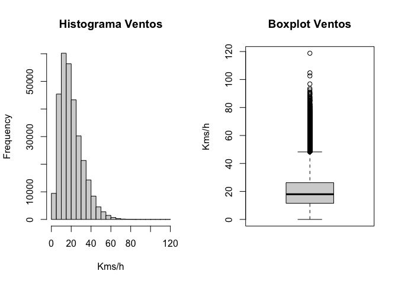
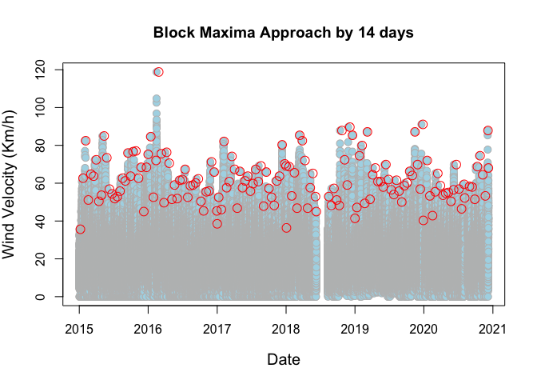
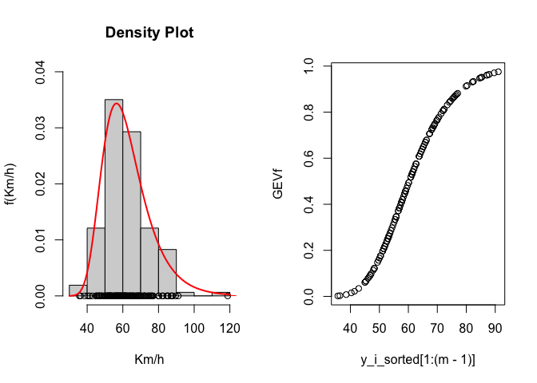
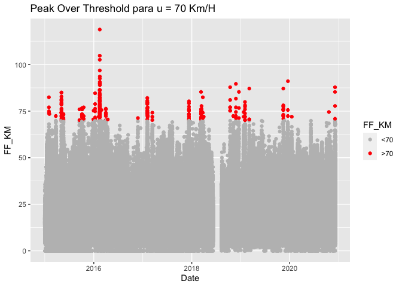
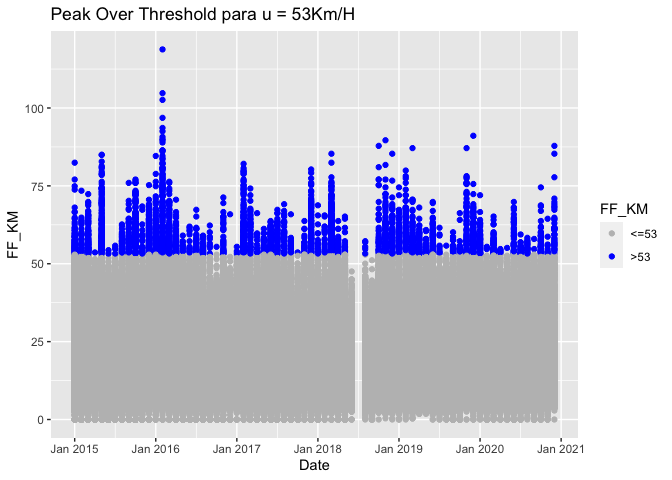
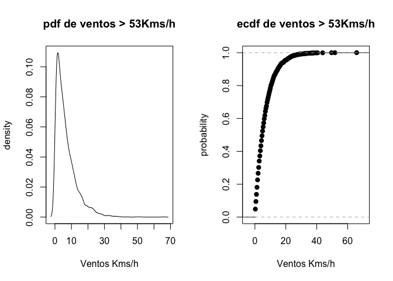
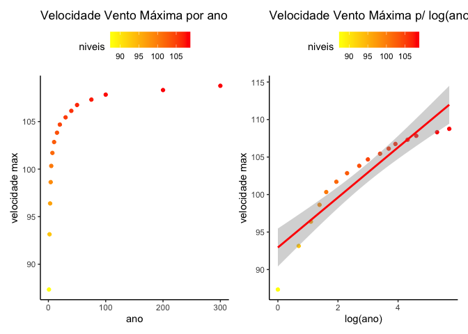
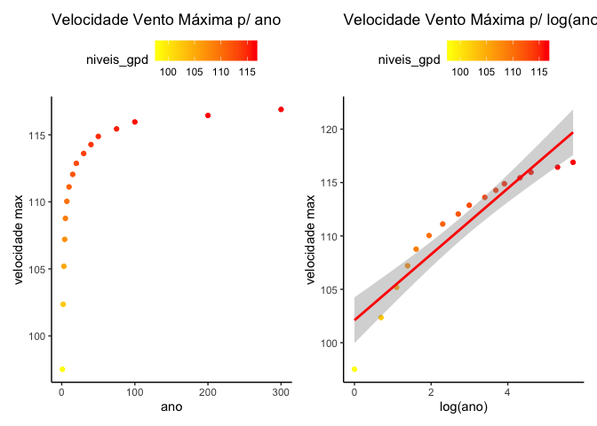

```r
library(readr)
library(dplyr)
library(lubridate) #date
library(xts) #zoo
library(reshape2) # table
library(ggplot2)
require(patchwork) #2 ggplots
```


# Introduction

Here I'll estimate extreme values for high quantiles, from a sample of max windspeeds within 6 years (10 min between each registry) registered at the airport Francisco Sá Carneiro (by IPMA).


# Extreme Value Theory (EVT)

For $X_{1},...,X_{n}$ iid rv with the same distribution function F. Let

$M_{n}=max(X_{1},...,X_{n})$ be the max of the first *n* observations
The distribution function $M_{n}$ is obtained from:

$P(M_{n} < x) = P(X_{1}<x,...,X_{n}<x) = F^{n}(x)$

But the limit for the max values is degenerate:

$∀x: x< sup(x:F(x)<1), F^{n}(x)_{n\to\infty}\to0 $


**Fisher-Tippet theorem**

In 1928, Fisher & Tipped demonstrated that for normalized constants ($a_{n}>0$) e ($b_{n}$), and the non-degenerate distribution function G(.), we have:

$P(\frac{M_{n}-b_{n}}{a_{n}}<x)_{\to\infty}\to G(x)$


Then, G(.) can take up 3 forms:

Type I (Gumbel):

$G(x)=\Lambda(x)=exp(-e^{-x})$

Type II (Fréchet):

*(if x < 0)* = $G(x)=0$
*(if x < 0)* = $G(x)=\phi(x)=exp{-e^{-x}}$

Type III (Weibull):

*(if x < 0)* = $G(x)\Psi(x)=exp(-(-x)^{\alpha})$
*(if x > 0)* = $G(x)=1$


These 3 can be expressed as one generalized function, the generalized extreme value (GEV) family of distributions:

$G(z) = exp[-(1+\xi(\frac{z-\mu}{\vartheta})^{\frac{-1}{\xi}}_{+}]$

with, $1 + \gamma(\frac{x-\mu}{\vartheta}>0)$

where (µ, σ, ξ) are location, scale and shape parameters.

Based on ξ, we can pick one of the 3 functions:

    + A Fréchet de cauda pesada df <- ξ > 0
    + A upper bounded Weibnull df <- ξ < 0
    + A Gumbel df <- ξ --> 0
    

Pickands (1975) introduced the limit distribution of the normalized excesses of limit *u*, as it approaches the end point, the Generalized Pareto Distribution (GPD):

$Pr(X < y|X>\mu)_{\mu\to\mu_{end}}\to H(y)$

with, $H(y)=-(1+\xi(\frac{z-\mu}{\vartheta})^{\frac{-1}{\xi}}_{+}$,

*O Teorema de Pickands-Balkema-de Haan*

Let $X_{1},...,X_{n}$ be an iid rv with distribution F, $x_{n}$ the upper limit of F, and $F_{u}(x)$ the distribution function for the excesses above *u*.

$$F \in DA(G_{\gamma})$$ iff, $\lim_{u \to xF}sup_{0<x<F-u}|F_{u}(x)-G_{\gamma,\vartheta_{u}}(x)|=0$


Gγ,σu(x) represents GPD, given by:

$G_{\gamma,\vartheta_{u}}(x)=1-(1+\gamma\frac{x}{\vartheta_{u}})^{\frac{-1}{\gamma}}=$

*(if γ ≠ 0)* = $1-(1+\frac{\gamma x}{\vartheta_{u}})$
*(if γ = 0)* = $e^{\frac{-x}{\vartheta_{u}}}$

based on $\gamma$, GPD can be subdivided into 3 categories:

Type I (Exponential):

$G(x)=1 - e^{-x}$

Type II (Pareto):

$G(x)=1-x^{-\alpha}$

Type III (Beta):

$G(x)=1(-x)^{\alpha}$


# Initial analysis


```r
X545_Porto_FFMax = read_delim("545_Porto_FFMax.csv", 
    ";", escape_double = FALSE, trim_ws = TRUE)

colnames(X545_Porto_FFMax)
```

```
## [1] "ESTACAO" "ANO"     "MS"      "DI"      "HR"      "MN"      "FF_MAX"
```


```r
par(mfrow=c(1,2))

windspeed = X545_Porto_FFMax

u = seq(0,90,1) # extremo do nível u dos excedentes é 90Kms/h

x = numeric()
y = numeric()
en_u = data.frame()

# Critérios de selecção do Ano e demais atributos
ws = subset(windspeed, FF_MAX != -990)
ws = subset(ws, !is.na(FF_MAX))
ws$FF_KM = ws$FF_MAX*3.6# criação de uma nova coluna (FF_KM), com o valor do vento calculado em Kms/h

hist(ws$FF_KM, main="Histograma Ventos",xlab="Kms/h", ylab="Frequency")
boxplot(ws$FF_KM, main="Boxplot Ventos", ylab="Kms/h")
```

<!-- -->

```r
paste("min: ",min(ws$FF_KM),"; max: ",max(ws$FF_KM),"; median: ",median(ws$FF_KM))
```

```
## [1] "min:  0 ; max:  118.8 ; median:  18"
```

# GEV (Generalized Extreme Value)

## Blocks Maxima

The estimation of $\mu$,$\sigma$,$\xi$ is the the most important aspect of this project. 

Next I proceed to compute the blocks maxima for a total of 299 thousand records of windspeeds from the last 6 years, devided in 157 blocks of size 14 days.


```r
Date.time <- ws %>% select(ANO, MS, DI, HR, MN) %>% mutate(Date_Time = make_datetime(ANO, MS, DI, HR, MN))
ws$Date <- Date.time$Date_Time

ws_2col <- ws[,c(9,8)]; ts.dat <- read.zoo(file = ws_2col); ep <- endpoints(ts.dat,"days", k=14)

FF_KM <- period.apply(x = ts.dat,ep,FUN = max); ws_d14 <- fortify.zoo(FF_KM, name="Date")
```


```r
plot(ws$Date, ws$FF_KM, xlab="Date", ylab="Wind Velocity (Km/h)",
     cex=1.25, cex.lab=1.25,
     col = "gray", bg = "lightblue", pch=21)
title(main = "Block Maxima Approach by 14 days")
points(ws_d14$Date, ws_d14$FF_KM, col="red", cex=1.5)
```

<!-- -->

```r
m = 157
y_i_sorted = sort(ws_d14$FF_KM)
```

# Maximum Likelihood parameter estimation (GEV)

Assuming $z_1,...,z_m$ iid rv following a GEV distribution, the log-likelihood for GEV when $\xi = 0$ is:

$l(\mu,\sigma)=-mlog\sigma-\sum_{i=1}^m (\frac{z_{i}}{\mu})-\sum_{i=1}^m exp(-(\frac{z_{i}}{\mu}))$

when

$1+\xi(\frac{z_{i}-\mu}{\sigma}) > 0$, for $i=1,...,m$

The maximization of these equations, for the vector $(\mu, \sigma, \xi)$ estimates ML for the entire GEV family. This has no analytical solution, but for each dataset, the maximization is easily achieved by numerical algorithms.

First we construct the ML function.


```r
GEV_M = function(xdat){
  z = list()
  
  #só teremos uma mu, um stdev e um shape
  npmu = 1
  npstdev = 1
  npsh = 1 #shape
  
  mumat = as.matrix(rep(1, length(xdat)))
  sigmat = as.matrix(rep(1, length(xdat)))
  shmat = as.matrix(rep(1, length(xdat)))
  
  #initial values for minimization routine (init for each parameter)
  siginit = sqrt(6 * var(xdat))/pi
  muinit = mean(xdat) - 0.57722 * siginit
  shinit = 0.1
  
  init = c(muinit, siginit, shinit)
  
  gev.MLE = function(a) {
  # computes -log lik of gev model
  mu = identity(mumat %*% a[1])
  sc = identity(sigmat %*% a[2])
	xi = identity(shmat %*% a[3])
	
	y = (xdat - mu)/sc
	y = 1 + xi * y
	#has to be positive
	if(any(y <= 0) || any(sc <= 0)) return(10^6)
	#function 
	sum(log(sc)) + sum(y^(-1/xi)) + sum(log(y) * (1/xi + 1))
  }
  
  #Initial values for the parameters to be optimized over.
  #A function to be minimized (or maximized), with first argument the vector of parameters over which minimization is to take place.
	x = optim(init, gev.MLE, hessian = TRUE, method = "Nelder-Mead",
                   control = list(maxit = 10000))
  #mle
	z$mle = x$par
	
	z$data = xdat

	invisible(z)
}
```

Then we aply our blocks maxima sample.


```r
par_GEV = GEV_M(y_i_sorted)
par_GEV
```

```
## $mle
## [1] 56.42652840 10.70281583 -0.07210582
## 
## $data
##   [1]  35.64  36.36  38.52  40.32  41.40  42.84  45.00  45.00  45.36  45.36
##  [11]  46.08  46.44  46.80  46.80  46.80  47.16  47.88  48.24  48.24  48.24
##  [21]  49.32  49.68  50.04  50.40  50.40  50.40  51.12  51.12  51.48  51.48
##  [31]  51.48  51.84  51.84  52.20  52.56  52.56  52.56  52.56  52.92  52.92
##  [41]  52.92  53.28  53.28  53.28  53.64  53.64  54.00  54.36  54.72  55.08
##  [51]  55.44  55.44  55.80  55.80  55.80  55.80  56.52  56.52  56.88  56.88
##  [61]  56.88  57.24  57.24  57.60  57.60  57.60  57.96  57.96  58.32  58.68
##  [71]  58.68  58.68  59.04  59.04  59.04  59.40  59.76  60.12  60.12  60.84
##  [81]  60.84  60.84  60.84  61.20  61.20  61.20  61.56  61.56  61.92  61.92
##  [91]  62.28  62.64  62.64  62.64  63.72  63.72  63.72  63.72  64.08  64.44
## [101]  64.44  64.80  65.16  65.16  65.52  65.88  65.88  66.24  66.24  67.32
## [111]  67.32  67.32  68.04  68.04  68.40  68.40  68.76  68.76  69.12  69.12
## [121]  69.84  69.84  69.84  70.20  70.56  71.28  72.00  72.00  72.00  72.36
## [131]  72.36  73.44  74.16  74.52  74.52  75.24  75.60  75.96  76.32  76.68
## [141]  77.04  79.92  80.28  82.08  82.44  82.44  84.60  84.96  85.32  85.32
## [151]  87.12  87.12  87.84  87.84  89.64  91.08 118.80
```

And verify the ML parameters with the histogram and density given by Gumbel, and the distribution function for GEV.


```r
par(mfrow=c(1,2))

gev.his = function(a, dat){
# Plots histogram of data and fitted density

  h = hist(dat, plot = FALSE)
	x_axis = seq(max(min(h$breaks), (a[1] - a[2]/a[3] + 0.001)), max(h$
			breaks), length = 100)

	# density
	gev.dens = function(a, z){ # evaluates gev density with parameters a at z 
  if(round(a[3],1) != 0)
    (exp( - (1 + (a[3] * (z - a[1]))/a[2])^(-1/a[3])) * (1 + (
			a[3] * (z - a[1]))/a[2])^(-1/a[3] - 1))/a[2]
    else { #gumbel 
      y = (z - a[1])/a[2]
	    (exp( - y) * exp( - exp( - y)))/a[2]
      }
}
	y = gev.dens(a, x_axis)
	#por causa do parâmetro, 
	dGumbel<-function(x,mu,sigma){exp(-((x-mu)/sigma+exp(-(x-mu)/sigma)))/sigma}
	# hist
	hist(dat, freq = FALSE, ylim=c(0,0.04),xlab = "Km/h", ylab = "f(Km/h)", 
		main = "Density Plot")
	# data
	points(dat, rep(0, length(dat)))
	#density
	lines(x_axis,y, col='red')
	#Gumbel
	curve(dGumbel(x, a[1], a[2]), add = TRUE, lwd=2, col="red")
}

gev.his(par_GEV$mle, par_GEV$data)


# gev com os parametros estimados
GEV_func = function(a, z){# gev dist fnc
	exp( - (1 + (a[3] * (z - a[1]))/a[2])^(-1/a[3]))}

GEVf = GEV_func(par_GEV$mle, y_i_sorted[1:(m-1)])
plot(y_i_sorted[1:(m-1)], GEVf)
```

<!-- -->


The maximization of the GEV log-likelihood for our dataset gives us $\mu, \sigma, \xi$:  56.4265284, 10.7028158, -0.0721058. 

# Peak Over Thresholds and GPD

In this metodology, the excesses above *u* are modelled with the GPD (McNeil & Saladin, 1997).

Choosing *u*:


```r
ggplot(data=ws, aes(x=Date, y=FF_KM)) + geom_point(aes(colour = cut(FF_KM, c(-Inf, 70, Inf)))) + 
  scale_color_manual(name = "FF_KM",
                     values = c("(-Inf,70]" = "gray",
                                "(70, Inf]" = "red"),
                     labels = c("<70", ">70")) +
  ggtitle("Peak Over Threshold para u = 70 Km/H")
```

<!-- -->


## Mean excess function


```r
# Função da média dos excessos da amostra - pág. 5 do artigo "The Peak over threshold method for estimating high quantiles of loss distributions"

for (j in 1:length(u)){
  x <- 0
  y <- 0
  for (i in 1: nrow(ws)){
    if(ws$FF_KM[i]>u[j]){
      x <- x + (ws$FF_KM[i]-u[j])
      y <- y + 1
    }
  }
  en_u[j,1] <- u[j]# definição do nível u[j], com registo para os diferentes valores que toma - [0,10,20,..., 90]
  en_u[j,2] <- x # Somatório dos ventos acima de u[j]
  en_u[j,3] <- y # função identidade para os valores dos ventos acima de u[j]
  en_u[j,4] <- x/y # função da média amostral dos excessos
  en_u[j,5] <- (1-y/nrow(ws)) # Quantil... por aqui se ê que temos extremos interessantes e significativos
}
```


```r
colnames(en_u) <- c("u","x","y","x_y", "quantile")
head(en_u)
```

```
##   u       x      y      x_y    quantile
## 1 0 6010793 296613 20.26477 0.008281788
## 2 1 5714217 296556 19.26859 0.008472366
## 3 2 5417817 296228 18.28935 0.009569026
## 4 3 5121966 295240 17.34848 0.012872380
## 5 4 4827598 292605 16.49868 0.021682437
## 6 5 4536426 289650 15.66175 0.031562406
```

```r
plot(en_u$u[1:nrow(en_u)],en_u$x_y, type="l", main="Mean Excess Plot", xlab="Threshold (u)",ylab="Mean Excess") # gráfico da função tal como sugerido pelo gráfico da função da média dos excessos

en_u_cor_10 <- cor(en_u[1:10,4],en_u[1:10,1]) # Cálculo da correlação entre os dados do u e os dados da ME
cor_10 <- lm(en_u[1:10,4]~en_u[1:10,1])
en_u_cor_70 <- cor(en_u[11:70,4],en_u[11:70,1])
cor_70 <- lm(en_u[11:63,4]~en_u[11:63,1])
abline(cor_10,col="red", lty=4)
abline(cor_70,col="blue", lty=2)
```

<!-- -->

Based on this and other simulations, I'll consider *u* = 53 Km/h.


```r
u_threshold <- 53
ws_u <- subset(ws, ws$FF_KM>u_threshold)
nrow(ws_u)
```

```
## [1] 3500
```

```r
ws$Date <- as.yearmon(paste(ws$ANO, ws$MS, ws$DI), "%Y %m %d")
ggplot(data=ws, aes(x=Date, y=FF_KM)) + geom_point(aes(colour = cut(FF_KM, c(-Inf, 53, Inf)))) + 
  scale_color_manual(name = "FF_KM",
                     values = c("(-Inf,53]" = "gray",
                                "(53, Inf]" = "blue"),
                     labels = c("<=53", ">53")) +
  ggtitle("Peak Over Threshold para u = 53Km/H")
```

<!-- -->

```r
paste("n.º registos com ventos > 53Kms/h =",nrow(ws_u))
```

```
## [1] "n.º registos com ventos > 53Kms/h = 3500"
```
In the 2 graphs below, it is displayed the PDF and the ECDF of our dataset of extreme windspeeds:


```r
par(mfrow=c(1,2))
plot(density(x=(ws_u$FF_KM-u_threshold)), main="pdf de ventos > 53Kms/h", xlab="Ventos Kms/h",ylab="density") # Plot da função densidade para os excessos acima de u (>53Kms/h) 
plot(ecdf(x=(ws_u$FF_KM-u_threshold)), main="ecdf de ventos > 53Kms/h", xlab="Ventos Kms/h",ylab="probability") # f.d. dos excessos acima de u (=70Kms/h)
```

<!-- -->

## Maximum Likelihood parameter estimation (GPD)

Having defined a threshold, GPD parameters can be estimated with ML.

Assuming $y_1, ..., y_k$ are *k* excesses above the threshold *u*. 

For $\xi≠0$ the log-likelihood is obtained by:

$l(\sigma,\xi)=-klog\sigma-(1+\frac{1}{\xi})\sum_{i=1}^{k}log(1+\frac{\xi y_i}{\sigma})$ when $(1+\sigma^{-1}\xi y_i)>0$ for $i=1,...,k$

If $\xi=0$ the log-likelihood is obtained by:
$l(\sigma) = -klog\sigma-\sigma^{-1}\sum_{i=1}^{k}y_{i}$

Now we can compute the maximization for the limit 53 Km/h.


```r
GPD_M = function(xdat, threshold){
  z = list()
  
  n = length(xdat)
  u = rep(threshold, length.out = n)
  
  xdatu = xdat[xdat > u]
  xind = (1:n)[xdat > u]
	u = u[xind]
	

	#só teremos uma mu, um stdev e um shape
  npmu = 1
  npstdev = 1
  npsh = 1 #shape
  
  mumat = as.matrix(rep(1, length(xdatu)))
  sigmat = as.matrix(rep(1, length(xdatu)))
  shmat = as.matrix(rep(1, length(xdatu)))
  
  
  #initial values for minimization routine (init for each parameter)
  siginit = sqrt(6 * var(xdatu))/pi
  muinit = mean(xdatu, na.rm = TRUE) - 0.57722 * siginit
  shinit = 0.1
  
  init = c(siginit, shinit)
  

  gpd.lik = function(a) {
  # calculates gpd neg log lik
	sc = identity(sigmat %*% (a[seq(1, length = 1)]))
	xi = identity(shmat %*% (a[seq(2, length = 1)]))
	
	y = (xdatu - u)/sc
	y = 1 + xi * y
  l = sum(log(sc)) + sum(log(y) * (1/xi + 1))}

  #Initial values for the parameters to be optimized over.
  #A function to be minimized (or maximized), with first argument the vector of parameters over which minimization is to take place.
  x = optim(init, gpd.lik, hessian = TRUE, method = "Nelder-Mead",
                   control = list(maxit = 10000))
  
  #mle
  z$mu = muinit
	z$mle = x$par
	z$threshold = threshold
	z$nexc = length(xdatu)

	invisible(z)
}

par_GPD = GPD_M(ws$FF_KM, 53)
par_GPD
```

```
## $mu
## [1] 56.83384
## 
## $mle
## [1]  6.98947000 -0.04487046
## 
## $threshold
## [1] 53
## 
## $nexc
## [1] 3500
```

The maximization of the log-likelihood for our dataset gives us the estimates for the vector $\mu, \sigma, \xi$:  6.98947, -0.0448705. 

# Extreme quantile estimation, Return Level and Return Period

## Return Level using using the ML parameters for GEV

The estimation of the blocks maxima extreme quantiles is obtained by the invertion of GEV.

$z_{p}=u - \frac{\sigma}{\xi}[1-(-log(1-p))^{-\xi}]$,  for $\xi≠0$ 

$z_{p}=u - \sigma log(-log(1-p))$,  for $\xi=0$

, where $G(z_{p}) = 1 - p$.

$z_{p}$ is the return level associated with the return period $\frac{1}{p}$, since it is expected that $z_{p}$ be exceeded on average once every $\frac{1}{p}$ blocks. $z_{p}$ is exceeded, in each block, with probability $p$. 

To compute the return level for 1 year, as an example, we have to compute the number of blocks. If each block is 14 days, every year has aproximatelly 26 blocks.


```r
#compute blocks per year
block_days = 14
blocks_per_year = 365/block_days; blocks_per_year
```

```
## [1] 26.07143
```

The function for getting the return levels:


```r
#function
zp = function(mu, stdev, sh, year){#sh - shape
  
  m_blocks = round(blocks_per_year)*year #obter blocos pela transformação
  
  #compute p
  p = 1/m_blocks
  
  yp = -log(1-p)
  if(sh==0){
    z = mu - stdev*log(yp)}
  else {
    z = mu - (stdev/sh)*(1-yp^-sh)}
}
```

The one year return level:


```r
y1max = zp(par_GEV$mle[1], par_GEV$mle[2], par_GEV$mle[3], 1) #mu, stdev, sh, year
y1max
```

```
## [1] 87.33853
```

Comparing with the max mean for our sample, it configures a good prediction.


```r
#agrupar por ano
table = ws %>% group_by(ANO) %>% summarise(n=n(), max=max(FF_KM)); table
```

```
## # A tibble: 6 x 3
##     ANO     n   max
##   <dbl> <int> <dbl>
## 1  2015 52560  85.0
## 2  2016 52704 119. 
## 3  2017 52560  82.1
## 4  2018 43716  89.6
## 5  2019 52213  91.1
## 6  2020 45337  87.8
```

```r
#média de velocidade máxima
mean_max = mean(table$max); mean_max
```

```
## [1] 92.4
```

We can evaluate the return levels jointly with the return periods:


```r
anos = c(1,2,3,4,5,7,10,15,20,30,40,50,75,100,200,300)
niveis = c(0)
for (i in 1:length(anos)){
  niveis[i] = zp(par_GEV$mle[1], par_GEV$mle[2], par_GEV$mle[3], i)
}


sem_log = ggplot() + 
  geom_point(aes(anos,niveis, color=niveis)) + 
  geom_smooth(method='lm', color = 'red') + 
  ggtitle('Velocidade Vento Máxima por ano') + 
  labs(x='ano', y='velocidade max') +
  scale_color_gradient(low = "yellow", high = "red") +
  theme_classic() + 
  theme(legend.position="top")

com_log = ggplot() + 
  geom_point(aes(log(anos),niveis, color=niveis)) + 
  geom_smooth(aes(log(anos),niveis), method='lm', color = 'red') + 
  ggtitle('Velocidade Vento Máxima p/ log(ano)') + 
  labs(x='log(ano)', y='velocidade max') +
  scale_color_gradient(low = "yellow", high = "red") +
  theme_classic() + 
  theme(legend.position="top")

sem_log+com_log
```

<!-- -->

## ## Return Level using using the ML parameters for GEV

Using the estimated parameters for the extreme value GPD, of a limit *u* of an *X* variable, for $x > u$:

$Pr(X>x) = \zeta_u[1+\xi(\frac{x-u}{\sigma})]^{-1 / \xi}$,

since $\zeta_u=Pr(X>u)$.

The level $x_m$ which is exceeded in each $m$ observations is:

$\zeta_u[1+\xi(\frac{x_m-\mu}{\sigma})^{-1/\xi}]=\frac{1}{m}$

rearranged,

$x_m=u+\frac{\sigma}{\xi}[(m\zeta_u)^\xi-1]$,

for $\xi≠0$. $m$ must be sufficiently large so that $x_m>u$. For $\xi=0$:

$x_m=u+\sigma log(m\zeta_u)$

$x_m$ is the return level of observation $m$. It is convenient to present this in an annual scale. Since we have $n_y$ observations per year, this corresponds to the observation $m$, where $m=Nn_y$, for $N$ years.

The natural estimator of $\zeta_u$ is given by $\hat\zeta_u=\frac{k}{n}$, the proportion of point that exceed $u$. 

For estimating the return level for 1 year, as an example, we compute the mean number of observations per year. Since each year has aproximately 49848 observations, we compute the return level for that number of observations, using $m=years*mean.observations/year$.


```r
#média de observações por ano
m_per_year = mean(table$n); m_per_year
```

```
## [1] 49848.33
```

```r
xm = function(mu, stdev, sh, year, xdat, u){
  
  #número de observações
  m = year*m_per_year #computar transformação para n observações
  
  k = length(xdat[xdat > u])
  n = length(xdat)
  #proportion of excesses
  zeta_u = k/n
  
  if(round(sh,1)==0) {
    xm_ = u + stdev * log(m*zeta_u)}
  else {
    xm_ = mu + stdev/sh * (((m*zeta_u)^sh)-1)}
}


xm1max = xm(par_GPD$mu, par_GPD$mle[1], par_GPD$mle[2], 1, ws$FF_KM, 53)
xm1max
```

```
## [1] 97.51425
```

The maximum windspeed value expected for one year, by the GPD, is 97.5142484 Km/h, very close to the dataset mean max values for a year 92.4 Km/h. 

Graphically:


```r
anos_gpd = c(1,2,3,4,5,7,10,15,20,30,40,50,75,100,200,300)
niveis_gpd = c(0)
for (i in 1:length(anos_gpd)){
  niveis_gpd[i] = xm(par_GPD$mu, par_GPD$mle[1], par_GPD$mle[2], i, ws$FF_KM, 53)
}


sem_log_gpd = ggplot() + 
  geom_point(aes(anos_gpd,niveis_gpd, color=niveis_gpd)) + 
  geom_smooth(method='lm', color = 'red') + 
  ggtitle('Velocidade Vento Máxima p/ ano') + 
  labs(x='ano', y='velocidade max') +
  scale_color_gradient(low = "yellow", high = "red") +
  theme_classic() + 
  theme(legend.position="top")

com_log_gpd = ggplot() + 
  geom_point(aes(log(anos_gpd),niveis_gpd, color=niveis_gpd)) + 
  geom_smooth(aes(log(anos_gpd),niveis_gpd), method='lm', color = 'red') + 
  ggtitle('Velocidade Vento Máxima p/ log(ano)') + 
  labs(x='log(ano)', y='velocidade max') +
  scale_color_gradient(low = "yellow", high = "red") +
  theme_classic() + 
  theme(legend.position="top")

sem_log_gpd+com_log_gpd
```

<!-- -->

